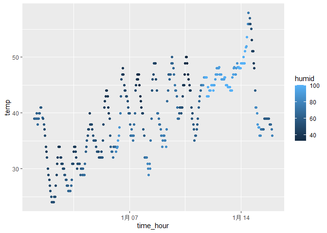

p8105_hw1_yd2868
================
2025-09-16

Load needed packs.

``` r
library(moderndive)
library(tidyverse)
```

    ## ── Attaching core tidyverse packages ──────────────────────── tidyverse 2.0.0 ──
    ## ✔ dplyr     1.1.4     ✔ readr     2.1.5
    ## ✔ forcats   1.0.0     ✔ stringr   1.5.1
    ## ✔ ggplot2   3.5.2     ✔ tibble    3.3.0
    ## ✔ lubridate 1.9.4     ✔ tidyr     1.3.1
    ## ✔ purrr     1.1.0     
    ## ── Conflicts ────────────────────────────────────────── tidyverse_conflicts() ──
    ## ✖ dplyr::filter() masks stats::filter()
    ## ✖ dplyr::lag()    masks stats::lag()
    ## ℹ Use the conflicted package (<http://conflicted.r-lib.org/>) to force all conflicts to become errors

# problem1

Load dataset

``` r
data("early_january_weather")
```

#### Description of the dataset

This dataset is hourly meteorological data for LGA, JFK and EWR for the
month of January 2013.

The variables are “origin”(Weather station,which is EWR); “year”,
“month”, “day”, “hour”(Time of recording); “temp”, “dewp”(Temperature
and dewpoint in F); “humid(Relative humidity)”; “wind_dir”,
“wind_speed”, “wind_gust”(Wind direction in degrees, speed and gust
speed in mph); “precip”(Precipitation, in inches); “pressure”(Sea level
pressure in millibars); “visib”(Visibility in miles); “time_hour”(Date
and hour of the recording as a POSIXct date).

This dataset has 358 rows and 15 columns.

The mean temperature is 39.5821229.

#### Scatterplot of temp vs time_hour

Draw and save the scatterplot

``` r
ggplot(data = early_january_weather , mapping = aes(y = temp , x = time_hour , color = humid)) + geom_point()
```

<!-- -->

``` r
ggsave("temp_vs_time_hour.png", path = "C:\\Users\\a1249\\OneDrive\\Desktop\\R homework\\p8105_hw1_yd2868")
```

    ## Saving 7 x 5 in image

# Problem2

Creat the data frame

``` r
num = rnorm(10, mean = 0, sd = 1)
df = tibble(
  number = num,
  logical = num > 0,
  character = c("a","b","c","d","e","f","g","h","i","j"),
  factor = factor(c("A","B","C","A","A","C","B","A","C","B"))
)
```

take the mean of each variable

``` r
mean(pull(df,1))
```

    ## [1] -0.1003727

``` r
mean(pull(df,2))
```

    ## [1] 0.5

``` r
mean(pull(df,3))
```

    ## Warning in mean.default(pull(df, 3)): 参数不是数值也不是逻辑值：返回NA

    ## [1] NA

``` r
mean(pull(df,4))
```

    ## Warning in mean.default(pull(df, 4)): 参数不是数值也不是逻辑值：返回NA

    ## [1] NA

apply as.numeric to three vectors

``` r
as.numeric(pull(df,2))
as.numeric(pull(df,3))
as.numeric(pull(df,4))
```

we can convert logical and factor variables to numeric variables, but
character variables do not have a natural numerical correspondence.

TRUE is converted to 1, while FALSE is converted to 0. This is why we
can compute the mean of a logical vector.

Factor variables are internally stored as integer codes representing
their levels, so converting them to numeric gives these integer codes.
By contrast, characters themselves do not have a natural numeric
correspondence, so attempting to convert them results in NA, and thus
taking the mean of a character vector is not possible.
